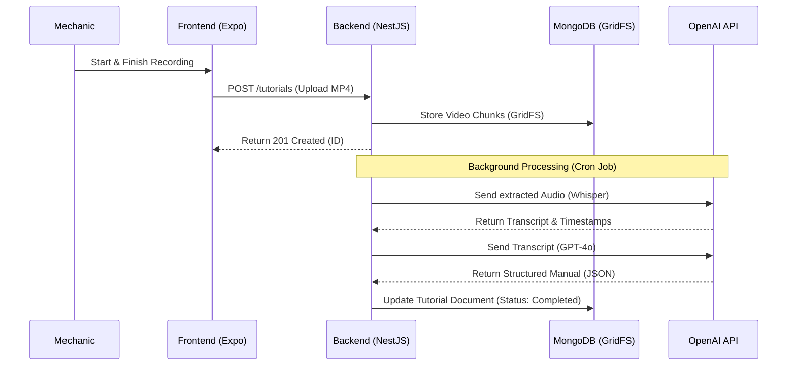
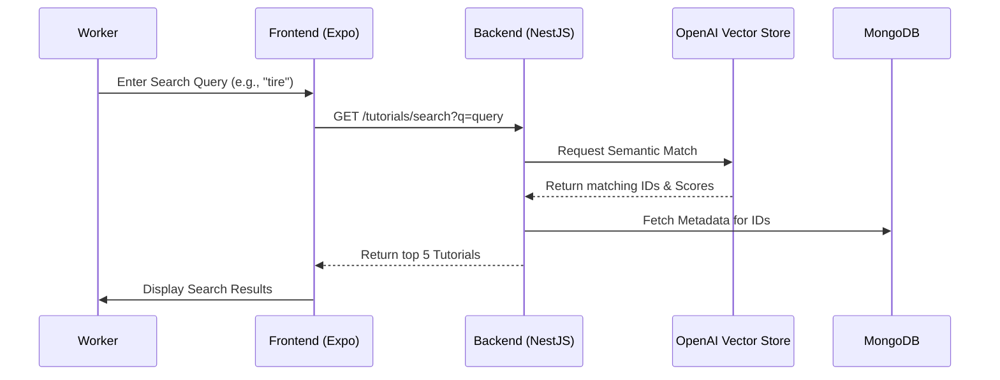
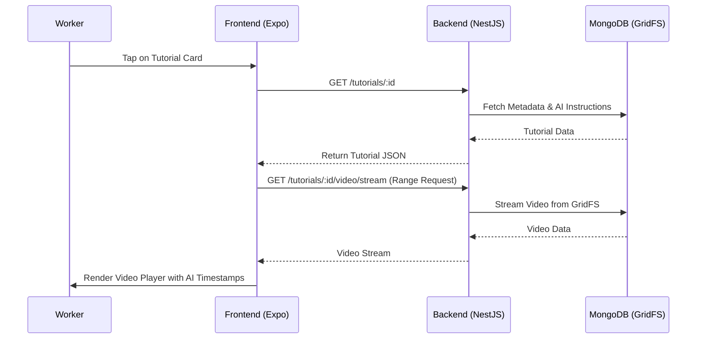

# SkillHeritage

    SkillHeritage is an industrial documentation platform that allows experienced workers to record video tutorials, which are then automatically processed by AI into structured, searchable step-by-step guides for new employees.

### Important Links

GitHub:
https://github.com/GermainGirndt/SkillHeritage

Trello – Project Management:
https://trello.com/b/nBguKruK/industrial-ux-engineering-skillheritage

Trello – Empathie-Karte / Empathy Map:
https://trello.com/b/OCDUJtJ7/industrial-ux-engineering-persona

## Project Architecture & Workflow

### High-Level System Flow

Use case 1: Record Video Tutorial



Use Case 2: Find Tutorial (Semantic Search)



Use Case 3: View Tutorial



### Uberspace

##### Access Server using SSH

```
ssh -i ./uberspace-tutorial-htw tutorial@alphard.uberspace.de
```

##### Transfering a file from the local machine to the remote server

```
scp -i ./uberspace-tutorial-htw localfile.txt tutorial@alphard.uberspace.de:/home/tutorial/
```

### Skill Heritage Directory in the Remote Server

```
/home/tutorial/source/SkillHeritage

[tutorial@alphard ~]$ tree . -L 3
.
|-- bin
|-- etc
| |-- certificates -> /readonly/tutorial/certificates
| |-- php.d
| |-- services.d
| `-- userfacts -> /opt/uberspace/userfacts/tutorial
|-- html -> /var/www/virtual/tutorial/html
|-- logs
|   |-- supervisord.log
|   `-- webserver -> /readonly/tutorial/logs
|-- Maildir
| |-- cur
| |-- new
| `-- tmp
|-- source
|   `-- SkillHeritage
| |-- backend
| |-- documentation
| |-- frontend
| `-- README.md
|-- tmp
|-- uberspace-tutorial-htw
|-- uberspace-tutorial-htw.pub
`-- users

20 directories, 4 files
```

##### Account Data

```
Username tutorial
E-Mail dial.58-scars@icloud.com
Hostname alphard.uberspace.de.
Username + Hostname: tutorial@alphard.uberspace.de
Backend Port: 3000
Backend Endpoint (Configured by me): https://tutorial.uber.space/
```

##### Free Backend Port

```
uberspace web backend set / --http --port 3000
```

##### Verify Ports

```
uberspace web backend list
```

#### Backend Management (Supervisor)

```
supervisorctl reread
supervisorctl update
supervisorctl status
```

### Using MongoDB

```
uberspace tools version use mongodb 4.2
```

### Using Git

```
eval "$(ssh-agent -s)"
ssh-add uberspace-tutorial-htw
```
